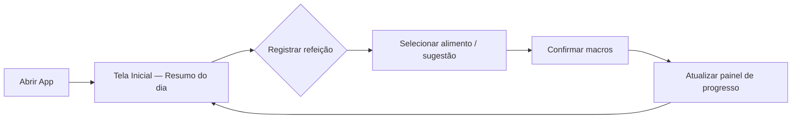

# Aula 16-03-2026

## Protótipo — Sistema de Cadastro de Macros

O protótipo interativo abaixo foi construído no **Figma Make** e representa a interface do produto "Sistema de Cadastro de Macros". Ele permite navegar pelas telas principais da aplicação diretamente nesta página.

<iframe
  src="https://www.figma.com/make/G4cGMRgfgccoYKyBInohxQ/Sistema-de-Cadastro-de-Macros?p=f&preview-route=%2Fadd-food"
  width="100%"
  height="700"
  style="border: 1px solid rgba(0,0,0,0.1); border-radius: 8px;"
  allowfullscreen>
</iframe>

---

## Descrição da Implementação do Produto

### Visão Geral

O **Sistema de Cadastro de Macros** é uma aplicação focada em simplificar o registro diário de macronutrientes (proteínas, carboidratos e gorduras) para pessoas que treinam de forma séria mas não vivem do esporte. O objetivo central é combater o catabolismo (perda de massa muscular) por falta de ingestão proteica adequada, oferecendo uma experiência de cadastro rápida e sem fricção.

### Problema que resolve

Aplicativos existentes como MyFitnessPal e MacroFactor sofrem com excesso de funcionalidades e complexidade no cadastro. O maior obstáculo de retenção em apps fitness é a "preguiça" do usuário frente a processos demorados. Este produto ataca esse gap diretamente.

### Funcionalidades Principais

| Funcionalidade | Descrição |
| --- | --- |
| **Cadastro rápido de refeição** | Registro simplificado de alimentos consumidos com foco em macronutrientes (proteína, carbo, gordura) |
| **Pré-refeições sugeridas** | Refeições frequentes ou planejadas são sugeridas ao usuário, eliminando cadastro repetitivo |
| **Painel de progresso diário** | Visualização clara do consumo acumulado vs. meta diária de proteína |
| **Notificações de confirmação** | Lembretes e confirmações que incentivam o registro contínuo ao longo do dia |

### Fluxo Principal do Usuário

### Indicadores de Sucesso

- **Retenção**: 30% dos usuários ativos após 3 semanas (benchmark para apps de nutrição)
- **Stickiness**: mínimo de 3 registros/dia (equivalente a 3 refeições)
- **Meta de proteína**: taxa de usuários que atingem a meta diária como métrica interna

### Stack Tecnológica (sugerida)

| Camada | Tecnologia |
| --- | --- |
| Frontend | React / React Native (mobile-first) |
| Backend | Node.js ou Python (FastAPI) |
| Banco de Dados | PostgreSQL + cache Redis |
| Autenticação | OAuth 2.0 / Firebase Auth |
| Deploy | GitHub Pages (docs) / Vercel ou Railway (app) |

---

## Navegação

- [Voltar para Aula 09-03-2026](aula-09-03-2026.md)
- [Página inicial](index.md)
